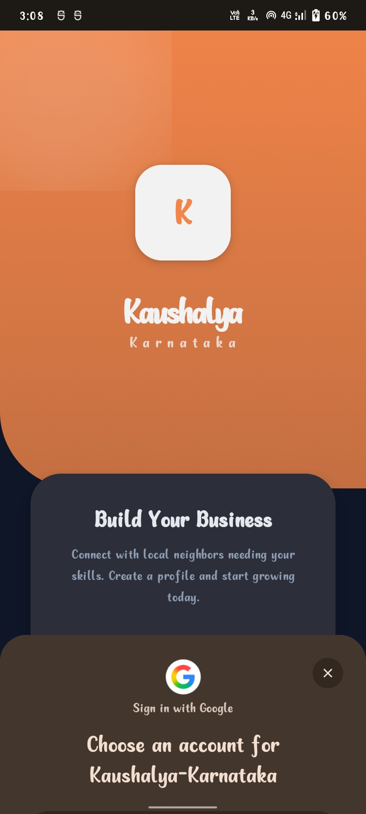
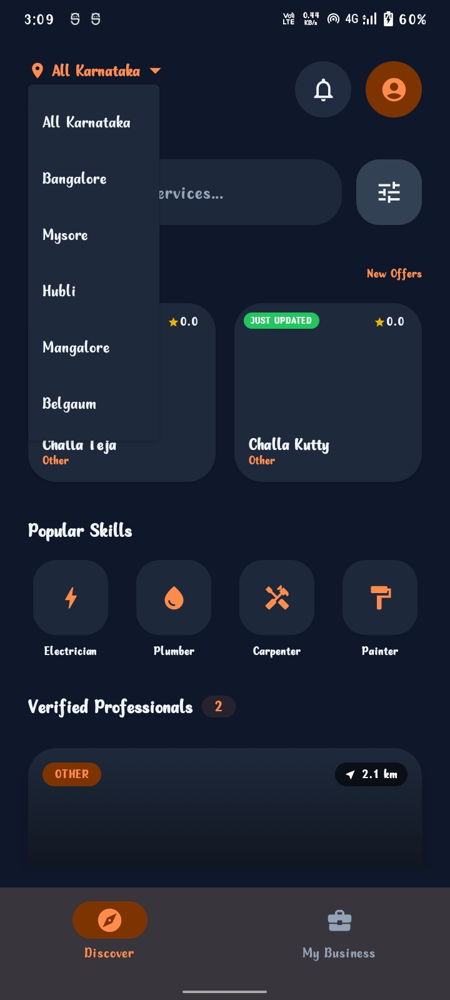
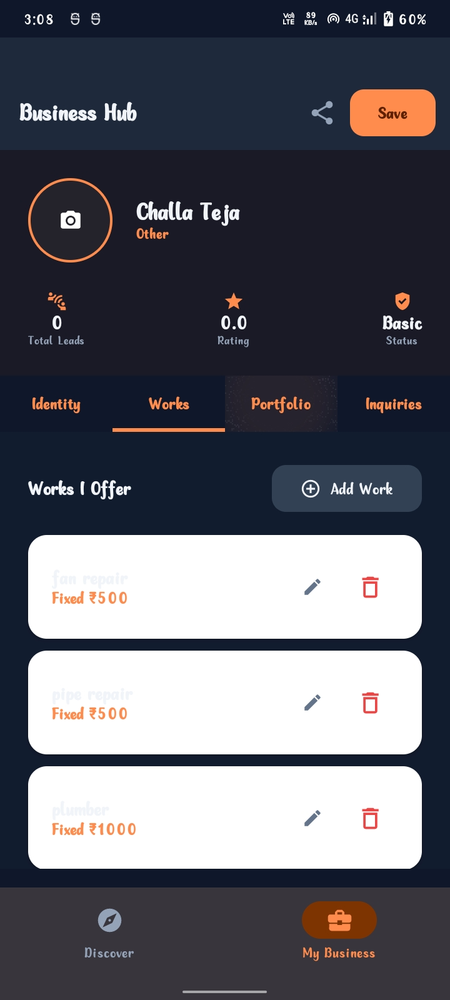

# 🛠️ Kaushalya Karnataka — Professional Discovery Hub

[](https://github.com/challateja/Kaushalya-Karnataka/actions/workflows/android.yml)
[](LICENSE)
[](https://kotlinlang.org/)
[](https://developer.android.com/jetpack/compose)
[](https://firebase.google.com/)

> **Empowering Karnataka's skilled workforce through local connectivity.**

---

## 📌 Problem Statement

In Karnataka, thousands of skilled workers — electricians, plumbers, carpenters, painters, masons, and AC technicians — struggle to find steady work despite having excellent skills. Neighbors looking for reliable professionals have no easy way to discover, compare, and contact verified local workers. Traditional word-of-mouth referrals are limited, and existing platforms do not cater specifically to the needs of Karnataka's local labor market.

**Kaushalya Karnataka** bridges this gap by providing a mobile-first professional discovery platform where skilled workers can build their digital professional identity and neighbors can instantly find, evaluate, and hire trusted local professionals.

---

## 🎯 Target Users

| User Type | Description |
|-----------|-------------|
| **Skilled Workers** | Electricians, plumbers, carpenters, painters, masons, welders, AC technicians |
| **Homeowners / Neighbors** | People looking to hire local professionals for home repairs, installations, and maintenance |
| **Small Business Owners** | Those needing regular skilled labor for commercial maintenance |

---

## 🚀 Key Features

### For Professionals (Workers)
- **Business Hub Dashboard** — Manage your professional identity with a 4-tab editor (Identity, Works, Portfolio, Inquiries)
- **Service Listing** — Add, edit, and remove services with pricing (fixed or starting-at pricing)
- **Portfolio Gallery** — Upload work photos to showcase verified work history
- **Lead Management** — View, respond to, and track customer hire requests with swipe-to-dismiss
- **Skills & Expertise Tags** — Add custom skill tags for better discoverability
- **Profile Sharing** — Share your professional profile with potential customers via Android share sheet

### For Neighbors (Customers)
- **Discovery Feed** — Browse verified local professionals with pull-to-refresh
- **Smart Search** — Search workers by name, skill, or specialty in real-time
- **Category Filters** — Filter by trade (Electrician, Plumber, Carpenter, Painter, Mason, AC Technician, Welder)
- **Location Filters** — Filter by operating district (Bangalore, Mysore, Hubli, Mangalore, etc.)
- **Advanced Filters** — Bottom sheet filter with minimum rating slider and budget range
- **Worker Detail View** — View full profile with services, reviews, portfolio, and hire dialog
- **Hire Request** — Send direct hiring inquiries with name, phone, and message
- **Review System** — Read and submit star-rated reviews for workers

### General
- **Google Sign-In** — Secure authentication via Firebase Auth and Android Credential Manager
- **Animated Splash Screen** — Branded splash with fade-in animations
- **Material 3 Theming** — Custom warm orange brand palette with light and dark mode support
- **Shimmer Loading** — Skeleton placeholder cards while content loads
- **Edge-to-Edge UI** — Modern full-screen experience with theme-aware system bars
- **Haptic Feedback** — Tactile feedback on key interactions for premium feel

---

## 🛠️ Tech Stack

| Layer | Technology |
|-------|-----------|
| **Language** | Kotlin (100%) |
| **UI Framework** | Jetpack Compose with Material 3 |
| **Architecture** | MVVM + Repository Pattern + Clean Architecture |
| **Authentication** | Firebase Auth + Google Sign-In + Android Credential Manager |
| **Database** | Firebase Cloud Firestore (Real-time NoSQL) |
| **Image Loading** | Coil for Compose |
| **Navigation** | Jetpack Navigation Compose |
| **Async** | Kotlin Coroutines + Flow + StateFlow |
| **CI/CD** | GitHub Actions (automated build & test) |
| **Min SDK** | Android 7.0 (API 24) |
| **Target SDK** | Android 16 (API 36) |

---

## 🏗️ Architecture

The project follows **Clean Architecture** principles with the **MVVM (Model-View-ViewModel)** design pattern:

```
┌──────────────────────────────────────────────┐
│                   UI Layer                    │
│   (Jetpack Compose Screens & Components)      │
│                                              │
│  SplashScreen → LoginScreen → MainScreen     │
│       DiscoveryScreen ←→ WorkerDetailScreen  │
│              ProfileEditorScreen             │
├──────────────────────────────────────────────┤
│             Presentation Layer               │
│        (ViewModels + StateFlow)              │
│                                              │
│  AuthVM  SplashVM  DiscoveryVM  ProfileVM    │
│              WorkerDetailVM  MainVM          │
├──────────────────────────────────────────────┤
│            Domain / Data Layer               │
│     (Repository + Models + Utilities)        │
│                                              │
│  WorkerRepository → Firebase Firestore       │
│  Worker, Service, Review, HireRequest models │
│  WorkerSearch utility (pure logic)           │
│  Resource sealed class (Loading/Success/Error)│
└──────────────────────────────────────────────┘
```

**Data Flow:**
1. UI observes `StateFlow` from ViewModel
2. ViewModel requests data from Repository
3. Repository fetches from Firebase Firestore (or local sample data as fallback)
4. Data is mapped to domain Models and sent to ViewModel
5. ViewModel updates UI State, triggering recomposition

> 📄 For a detailed architecture breakdown, see [`docs/ARCHITECTURE.md`](docs/ARCHITECTURE.md)

---

## 📂 Folder Structure

```
Kaushalya-Karnataka/
├── .github/
│   └── workflows/
│       └── android.yml              # GitHub Actions CI/CD pipeline
├── app/
│   └── src/
│       ├── main/
│       │   ├── java/com/example/kaushalya_karnataka/
│       │   │   ├── MainActivity.kt          # Entry point with edge-to-edge setup
│       │   │   ├── components/              # Reusable UI components
│       │   │   │   ├── CategoryChip.kt      # Filter chip for categories
│       │   │   │   ├── EmptyState.kt        # Empty state placeholder
│       │   │   │   ├── HireDialog.kt        # Hire request dialog
│       │   │   │   ├── ReviewDialog.kt      # Review submission dialog
│       │   │   │   ├── ReviewItem.kt        # Individual review card
│       │   │   │   ├── ServiceCard.kt       # Service listing card
│       │   │   │   ├── ShimmerWorkerCard.kt # Shimmer loading skeleton
│       │   │   │   ├── StarRating.kt        # Star rating component
│       │   │   │   └── WorkerCard.kt        # Worker profile card
│       │   │   ├── data/                    # Data layer
│       │   │   │   ├── SampleData.kt        # Mock data for offline/demo
│       │   │   │   └── WorkerRepository.kt  # Firestore data repository
│       │   │   ├── models/                  # Domain models
│       │   │   │   └── Worker.kt            # Worker, Service, Review, HireRequest, PortfolioImage
│       │   │   ├── navigation/              # App navigation
│       │   │   │   └── NavGraph.kt          # Navigation graph with routes
│       │   │   ├── screens/                 # Full-screen composables
│       │   │   │   ├── DiscoveryScreen.kt   # Professional discovery feed
│       │   │   │   ├── LoginScreen.kt       # Google Sign-In screen
│       │   │   │   ├── MainScreen.kt        # Bottom nav container
│       │   │   │   ├── ProfileEditorScreen.kt # 4-tab business hub
│       │   │   │   ├── SplashScreen.kt      # Animated splash screen
│       │   │   │   └── WorkerDetailScreen.kt # Worker profile detail view
│       │   │   ├── ui/theme/                # Material 3 theming
│       │   │   │   ├── Color.kt             # Custom orange brand palette
│       │   │   │   ├── Theme.kt             # Light/dark theme definitions
│       │   │   │   └── Type.kt              # Typography system
│       │   │   ├── util/                    # Utility classes
│       │   │   │   ├── Resource.kt          # Loading/Success/Error wrapper
│       │   │   │   └── WorkerSearch.kt      # Search/filter logic
│       │   │   └── viewmodel/               # MVVM ViewModels
│       │   │       ├── AuthViewModel.kt     # Authentication state
│       │   │       ├── DiscoveryViewModel.kt # Discovery feed logic
│       │   │       ├── MainViewModel.kt     # Main screen state
│       │   │       ├── ProfileEditorViewModel.kt # Profile editing logic
│       │   │       ├── SplashViewModel.kt   # Splash navigation logic
│       │   │       └── WorkerDetailViewModel.kt # Worker detail logic
│       │   └── res/                         # Android resources
│       │       ├── drawable/                # Icons and graphics
│       │       ├── mipmap-*/                # App launcher icons
│       │       ├── values/                  # Colors, strings, themes
│       │       └── xml/                     # Backup rules, data extraction
│       ├── test/                            # Unit tests
│       └── androidTest/                     # Instrumentation tests
├── docs/
│   └── ARCHITECTURE.md                      # Detailed architecture documentation
├── Screenshots/                             # App screenshots
│   ├── login_screen.jpeg                    # Google Sign-In screen
│   ├── discovery_feed.jpeg                  # Professional discovery feed
│   ├── worker_cards.jpeg                    # Worker profile cards
│   ├── location_filter.jpeg                 # District-based filtering
│   ├── profile_editor.jpeg                  # Business hub profile editor
│   └── services_tab.jpeg                    # Services management tab
├── build.gradle.kts                         # Root build configuration
├── app/build.gradle.kts                     # App module build with dependencies
├── settings.gradle.kts                      # Project settings
├── gradle.properties                        # Gradle properties
├── firebase.json                            # Firebase project configuration
├── firestore.rules                          # Firestore security rules
├── CHANGELOG.md                             # Version history
├── CONTRIBUTING.md                          # Contribution guidelines
├── LICENSE                                  # MIT License
└── README.md                                # This file
```

---

## 📸 Screenshots

| Login Screen | Discovery Feed | Worker Cards |
|:---:|:---:|:---:|
|  |  |  |

| Location Filter | Profile Editor | Services Tab |
|:---:|:---:|:---:|
|  |  |  |

---

## ⚙️ Installation & Setup

### Prerequisites
- **Android Studio** Ladybug (2024.2.1) or later
- **JDK 17** or higher
- **Android SDK** with API 36 installed
- A **Firebase project** with Firestore and Authentication enabled
- **Git** installed on your system

### Step-by-Step Setup

1. **Clone the repository**
   ```bash
   git clone https://github.com/challateja/Kaushalya-Karnataka.git
   cd Kaushalya-Karnataka
   ```

2. **Open in Android Studio**
   - Launch Android Studio
   - Select **Open** and navigate to the cloned directory
   - Wait for Gradle sync to complete

3. **Configure Firebase**
   - Go to [Firebase Console](https://console.firebase.google.com/)
   - Create a new project or use an existing one
   - Register your Android app with package name: `com.example.kaushalya_karnataka`
   - Download `google-services.json` and place it in the `app/` directory
   - Enable **Authentication** (Google Sign-In provider)
   - Enable **Cloud Firestore** database

4. **Deploy Firestore Security Rules** (Optional)
   ```javascript
   rules_version = '2';
   service cloud.firestore {
     match /databases/{database}/documents {
       match /workers/{workerId} {
         allow read: if request.auth != null;
         allow write: if request.auth != null && request.auth.uid == workerId;
       }
       match /workers/{workerId}/hireRequests/{requestId} {
         allow read, write: if request.auth != null;
       }
     }
   }
   ```

5. **Build the project**
   ```bash
   ./gradlew assembleDebug
   ```

6. **Run on emulator or device**
   ```bash
   ./gradlew installDebug
   ```
   Or press **Run ▶** in Android Studio.

---

## 🧪 Testing

### Unit Tests
Run unit tests to verify business logic (search filtering, data mapping):
```bash
./gradlew test
```

### Instrumentation Tests
Run UI tests on an Android emulator or connected device:
```bash
./gradlew connectedAndroidTest
```

### CI/CD
The project includes a **GitHub Actions** workflow (`.github/workflows/android.yml`) that automatically:
- Sets up JDK 17 with Gradle caching
- Builds the debug APK (`./gradlew assembleDebug`)
- Runs unit tests (`./gradlew test`)

This runs on every push and pull request to the `main` branch.

---

## 📊 Project Statistics

| Metric | Value |
|--------|-------|
| **Total Source Files** | 45+ (Kotlin, XML) |
| **Lines of Code** | 4,300+ meaningful lines |
| **Reusable Components** | 9 custom composable components |
| **Screens** | 6 full-screen composables |
| **ViewModels** | 6 MVVM ViewModels |
| **Data Models** | 5 domain models (Worker, Service, Review, HireRequest, PortfolioImage) |
| **Total Commits** | 16 incremental commits |
| **Architecture** | MVVM + Repository + Clean Architecture |

---

## 🔮 Future Improvements

- [ ] **Real-time Chat** — In-app messaging between workers and customers using Firebase Realtime Database
- [ ] **Push Notifications** — Firebase Cloud Messaging for new hire requests and lead updates
- [ ] **Image Upload to Cloud** — Firebase Storage integration for profile and portfolio images
- [ ] **Worker Verification System** — Aadhaar-based identity verification for trust badges
- [ ] **Payment Integration** — UPI/Razorpay integration for advance booking payments
- [ ] **Multi-language Support** — Kannada, Hindi, and English localization
- [ ] **Location-based Discovery** — GPS-powered nearby worker suggestions using Google Maps SDK
- [ ] **Analytics Dashboard** — Worker performance metrics (views, conversion rate, response time)
- [ ] **Rating Aggregation** — Automated star rating calculation from customer reviews
- [ ] **Offline Mode** — Room database caching for offline access to worker profiles
- [ ] **Deep Linking** — Direct links to worker profiles for sharing on social media

---

## 🤝 Contributing

Contributions are welcome! Please read the [Contributing Guidelines](CONTRIBUTING.md) before submitting a pull request.

1. Fork the repository
2. Create your feature branch (`git checkout -b feature/amazing-feature`)
3. Commit your changes (`git commit -m 'Add amazing feature'`)
4. Push to the branch (`git push origin feature/amazing-feature`)
5. Open a Pull Request

---

## 📄 License

This project is licensed under the **MIT License** — see the [LICENSE](LICENSE) file for details.

---

## 👨‍💻 Developer

**Challa Teja**

Built as a professional solution to connect Karnataka's skilled workforce with local communities.

---

> *A simple but complete project with clear code, a good README, proper structure, and working setup instructions will score better than a large but confusing or incomplete repository.* — Evaluation Guidelines
