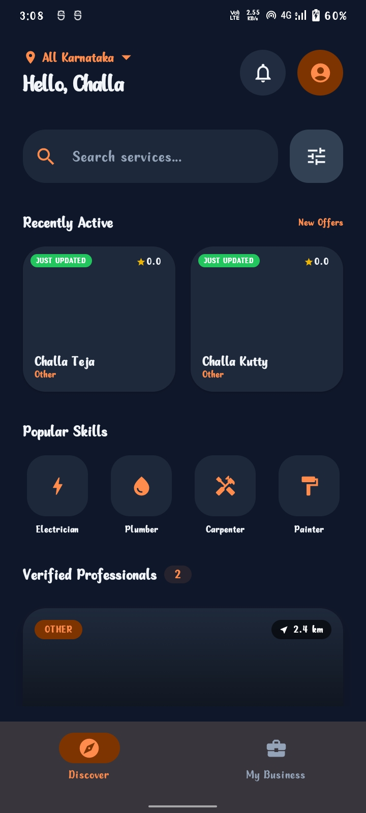
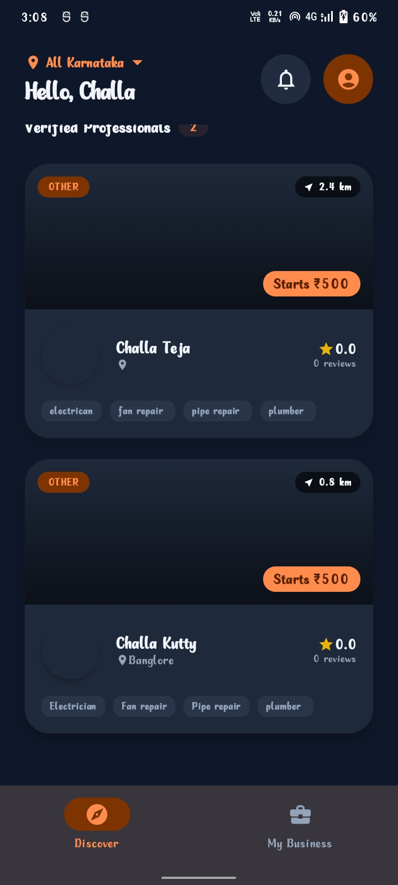
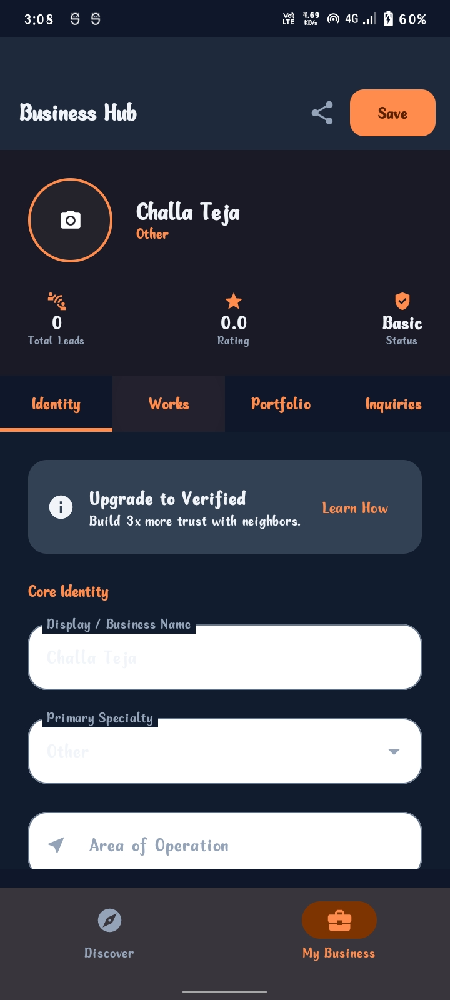

# Kaushalya Karnataka - Professional Hub 🛠️

[](https://github.com/challateja/Kaushalya-Karnataka/actions/workflows/android.yml)
[](https://opensource.org/licenses/MIT)

**Empowering Karnataka's Skilled Workforce through Local Connectivity.**

Kaushalya Karnataka is a high-end professional discovery platform built with modern Android standards. It connects skilled laborers (Electricians, Plumbers, Carpenters, etc.) directly with local neighbors in their district, enabling instant job leads and transparent pricing.

---

## 📝 Problem Statement
In many parts of Karnataka, skilled workers struggle to find consistent local work despite their expertise. Simultaneously, residents find it difficult to hire trusted professionals for quick repairs. Kaushalya Karnataka bridges this gap by providing a transparent, real-time platform for professional discovery within local communities.

## 🚀 Key Features

-   **Business Hub**: A dedicated dashboard for workers to manage their professional identity, list works, and showcase a portfolio.
-   **Works Catalog**: Add specific tasks you can perform (e.g., "Fan Repair", "Floor Cleaning") with optional pricing.
-   **Real-time Inquiries**: Receive hiring requests directly from neighbors in real-time.
-   **Pro Discovery**: Advanced search and filtering by location, rating, and specific skills.
-   **Recently Active Feed**: Real-time ranking that promotes workers who have recently updated their offers.
-   **Secure Authentication**: Google Sign-In integration for seamless and secure access.

## 🛠️ Tech Stack

-   **UI**: Jetpack Compose (100% Kotlin)
-   **Architecture**: MVVM (Model-View-ViewModel) with Repository Pattern
-   **Database**: Firebase Firestore (Real-time streams)
-   **Auth**: Firebase Authentication (Google Sign-In)
-   **Image Loading**: Coil
-   **Navigation**: Jetpack Navigation Compose
-   **Async**: Kotlin Coroutines & Flow
-   **Dependency Management**: Gradle Version Catalog

## 📂 Project Structure

```text
app/src/main/java/com/example/kaushalya_karnataka/
├── components/   # Reusable UI elements (WorkerCard, ServiceCard, etc.)
├── data/         # Repository pattern & Firestore data source
├── models/       # Data classes (Worker, Service, HireRequest)
├── navigation/   # Screen definitions & NavHost configuration
├── screens/      # Feature-specific screens (Discovery, Profile Hub, Login)
├── ui/theme/     # Design system (Colors, Type, Shape)
├── util/         # Helper functions and business logic
└── viewmodel/    # State management logic
```

## 📸 Screenshots
| Discovery Feed | Worker Profile | Profile Editor |
|---|---|---|
|  |  |  |

## ⚙️ Setup & Installation

1.  **Clone the Repository**: 
    ```bash
    git clone https://github.com/challateja/Kaushalya-Karnataka.git
    ```
2.  **Firebase Configuration**:
    -   Add `google-services.json` to the `/app` directory.
    -   Enable Firestore and Authentication (Google Sign-In) in your Firebase Console.
    -   Set Firestore Rules to `allow read, write: if request.auth != null;`
3.  **Build**: Open in Android Studio and click 'Sync Project with Gradle Files'.
4.  **Run**: Deploy to an emulator or physical device running API 24+.
    ```bash
    ./gradlew installDebug
    ```

## 🧪 Testing
Run unit tests to verify business logic:
```bash
./gradlew test
```

## 🔮 Future Improvements
-   [ ] **In-app Chat**: Direct messaging between workers and customers.
-   [ ] **Worker Verification**: Verified badges for professionals with background checks.
-   [ ] **Payment Integration**: Secure escrow payments for completed tasks.
-   [ ] **Multi-language Support**: Kannada and English interface.

---
Developed with ❤️ for the local labor market in Karnataka.
